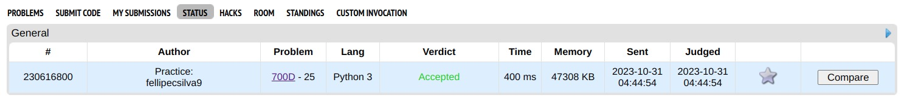
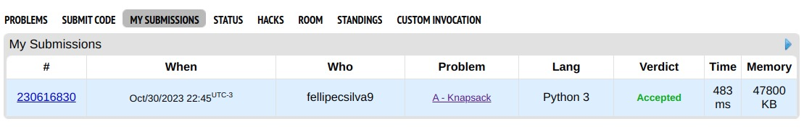

# Exercícios Resolvidos

**Conteúdo da Disciplina**: Algoritmos Ambiciosos

## Alunos

|Matrícula | Aluno |
| -- | -- |
| 20/0017772  |  Fellipe Pereira da Costa Silva |
| 18/0104390  |  Lameque Fernandes de Azevedo |

## Sobre 

O repositório contém soluções para algumas questões de juíz online. Segue a lista dos exercicios escolhidos:

- Huffman Coding on Segment (https://codeforces.com/contest/700/problem/D)
- Knapsack (https://codeforces.com/contest/1446/problem/A)
- BUSYMAN - I AM VERY BUSY (https://www.spoj.com/problems/BUSYMAN/)
- Death Note (https://codeforces.com/contest/1016/problem/A)


## Screenshots

- Huffman Coding on Segment



- Knapsack



- BUSYMAN - I AM VERY BUSY 


## Instalação 
Para executar as questões deste repositório, é necessário ter um interpretador python3.

## Uso 

Passo a passo:
1. Clone o repositório utilizando o seguinte comando: ```git clone https://github.com/projeto-de-algoritmos/Greed_Exercicios_Juiz_Online.git```
2. Entre na pasta da questão que deseja executar: ```cd <pasta_da_questao>```
3. Rodar questão: ```python3 <nome_do_arquivo_executavel>```

*OBS*: Caso queira executar a questão com uma das entradas de exemplo fornecidas, utilize o seguinte comando: ```python3 <nome_do_arquivo_executavel> < in.txt``` 
Dessa forma, será possível testar a questão com os exemplos de entrada fornecidos.

## Apresentação

Assista o vídeo explicativo do projeto clicando [aqui](assets/apresentacao.mp4).

Observação: A apresentação está em formato .mp4, portanto, faça o download para assisti-la.
